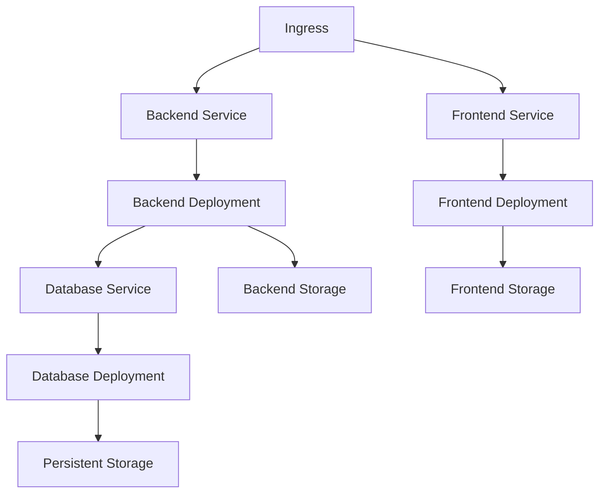

# COARLUMINI 


## Descripción

ACEste proyecto implementa una arquitectura de microservicios utilizando Kubernetes y Docker para garantizar alta disponibilidad, escalabilidad y facilidad de mantenimiento.

## Arquitectura en Kubernetes

El sistema está desplegado en Google Kubernetes Engine (GKE) con la siguiente estructura:



### Componentes en Kubernetes

- **Namespace**: Todos los recursos están aislados en el namespace `coarlumini`
- **ConfigMaps y Secrets**: Almacenan configuraciones y credenciales
- **Deployments**: Manejan los pods para Frontend, Backend y Base de datos
- **Services**: Exponen los deployments internamente y a través del ingress
- **PersistentVolumeClaims**: Aseguran persistencia de datos
- **Ingress**: Gestiona el tráfico externo hacia la aplicación

## Contenedores Docker

El proyecto utiliza tres contenedores principales:

### Frontend (Vue.js + Nginx)

```dockerfile
# Contenedor basado en nginx:stable-alpine
# Sirve la aplicación Vue.js compilada
# Se comunica con el backend a través de proxy inverso
```

### Backend (Laravel + PHP-FPM + Nginx)

```dockerfile
# Contenedor multi-stage:
# 1. Build con Composer
# 2. PHP-FPM con Nginx para servir Laravel
# Incluye todas las extensiones PHP necesarias
```

### Database (MySQL)

```dockerfile
# Contenedor MySQL con configuración optimizada
# Almacenamiento persistente mediante volúmenes
# Respaldos automatizados
```

## Despliegue en GKE

### Prerrequisitos

- Google Cloud SDK
- kubectl
- Docker
- Acceso a un proyecto GCP

### Pasos para desplegar

1. **Preparar entorno local**
   ```bash
   # Clonar el repositorio
   git clone https://github.com/username/coarlumini.git
   cd coarlumini
   ```

2. **Construir y subir imágenes**
   ```bash
   # Ejecutar script de construcción
   cd k8s
   ./build-images.sh
   ```

3. **Desplegar en Kubernetes**
   ```bash
   # Conectarse al cluster
   gcloud container clusters get-credentials cluster-name --zone zone --project project-id

   # Aplicar manifiestos en orden
   kubectl apply -f 00-namespace.yaml
   kubectl apply -f 01-configmap.yaml
   kubectl apply -f 02-secrets.yaml
   kubectl apply -f 03-database-pvc.yaml
   kubectl apply -f 04-database-deployment.yaml
   kubectl apply -f 05-database-service.yaml
   kubectl apply -f 06-backend-deployment.yaml
   kubectl apply -f 07-backend-pvc.yaml
   kubectl apply -f 08-backend-service.yaml
   kubectl apply -f 09-frontend-deployment.yaml
   kubectl apply -f 10-frontend-pvc.yaml
   kubectl apply -f 11-nginx-config.yaml
   kubectl apply -f 12-frontend-service.yaml
   kubectl apply -f 13-ingress.yaml

   # O aplicar todos a la vez
   kubectl apply -f k8s/
   ```

4. **Verificar el despliegue**
   ```bash
   # Verificar pods
   kubectl get pods -n coarlumini

   # Verificar servicios
   kubectl get services -n coarlumini

   # Obtener la IP del ingress
   kubectl get ingress -n coarlumini
   ```

## Escalabilidad

El sistema está diseñado para escalar horizontal y verticalmente:

- **Escalado Horizontal**: Aumentar número de réplicas para cada componente
  ```bash
  kubectl scale deployment coarlumini-frontend --replicas=3 -n coarlumini
  kubectl scale deployment coarlumini-backend --replicas=3 -n coarlumini
  ```

- **Autoscaling**: Configurado para escalar automáticamente basado en uso de CPU
  ```yaml
  apiVersion: autoscaling/v2
  kind: HorizontalPodAutoscaler
  metadata:
    name: coarlumini-backend-hpa
  spec:
    scaleTargetRef:
      kind: Deployment
      name: coarlumini-backend
    minReplicas: 1
    maxReplicas: 5
    metrics:
    - type: Resource
      resource:
        name: cpu
        target:
          type: Utilization
          averageUtilization: 70
  ```

- **Base de datos**: Configurada para escalabilidad vertical y replicación

## Monitoreo y Mantenimiento

- **Logs**: Accesibles mediante kubectl
  ```bash
  kubectl logs deployment/coarlumini-backend -n coarlumini
  ```

- **Estado de pods**:
  ```bash
  kubectl get pods -n coarlumini
  kubectl describe pod [nombre-del-pod] -n coarlumini
  ```

- **Shell a contenedores**:
  ```bash
  kubectl exec -it [nombre-del-pod] -n coarlumini -- /bin/bash
  ```

## Desarrollo Local

Para desarrollo local, puedes usar Docker Compose:

```bash
# Clonar el repositorio
git clone https://github.com/username/coarlumini.git
cd coarlumini

# Iniciar el entorno
docker-compose up -d

# Acceder a la aplicación
# Frontend: http://localhost
# Backend API: http://localhost/api
```

## Ventajas de la Arquitectura

- **Alta disponibilidad**: La aplicación está distribuida en múltiples nodos
- **Escalabilidad**: Puede manejar aumentos de tráfico automáticamente
- **Recuperación automática**: Kubernetes reinicia pods en caso de fallos
- **Despliegue sin tiempo de inactividad**: Actualizaciones graduales sin interrupciones
- **Gestión eficiente de recursos**: Optimización automática de recursos del cluster

## Licencia

Este proyecto está licenciado bajo la licencia MIT - ver el archivo LICENSE para más detalles.
